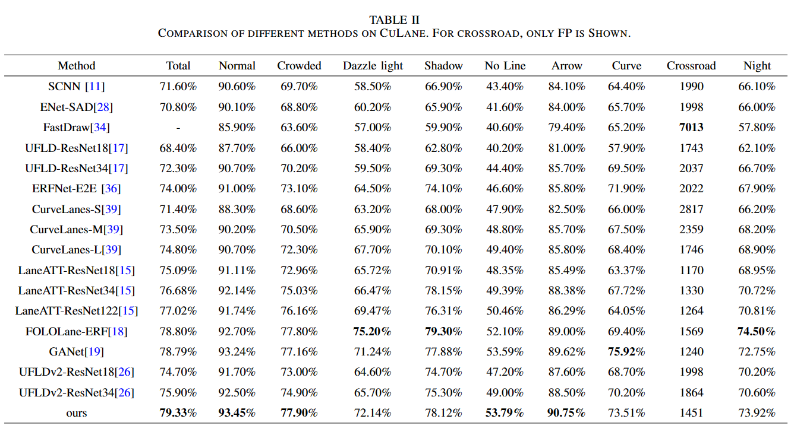

# **Oblique Convolution: A Novel Convolution Idea for Redefining Lane Detection**


PyTorch implementation of the paper "Oblique Convolution: A Novel Convolution Idea for Redefining Lane Detection"


ORM architecture. α1, α2, α3, α4, -α1, -α2, -α3, -α4 is the angle obtained by clustering. Group convolution is used to separate them between different angles and finally stitch them together. Through rotating different angles and grouping convolution, the features of all vertical lane lines are obtained.


SSAM first performs the maxpooling, and then uses the strip 3 × H deformable convolution with a certain width to directly extract the information of the whole lane and give different pixel points importance.

## **Changelog**


- [2023-02-22] Release the initial code for SIFDriveNet.


## **一、Path preparation**


please modify data_root and log_path in your configs/culane.py or configs/tusimple.py config according to your environment.

data_root is the path of your CULane dataset or Tusimple dataset.
log_path is where tensorboard logs, trained models and code backup are stored. 


## **二、Quick Start**

#### 1.Environment configuration: Clone repo and install requirements.txt in a Python>=3.6.0 environment, including PyTorch>=1.7.

```
git clone https://github.com/gongyan1/Oblique-Convolution.git
pip install -r requirements.txt  # install
```

#### 2.train

```
python train.py configs/path_to_your_config
```

#### 3.test

```
python test.py configs/culane.py --test_model path_to_culane.pth --test_work_dir ./tmp

python test.py configs/tusimple.py --test_model path_to_tusimple.pth --test_work_dir ./tmp
```

#### 4.result

Performance comparison with other lane detection methods on Tusimple dataset.


Performance comparison with other lane detection methods on CULane dataset.




